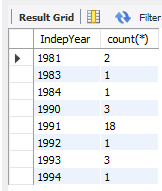
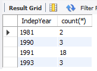
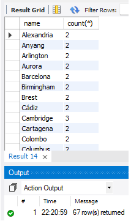
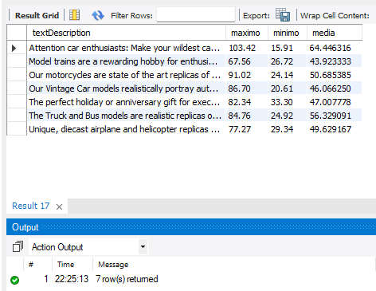
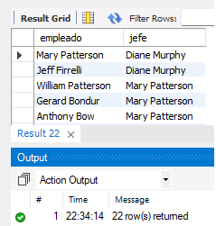
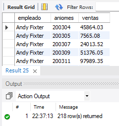
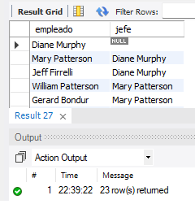

# Grupo de ejercicios 1

## Ejercicios básicos

1. Mostrar las ciudades de España que tienen más de 100.000 habitantes. Resultado: 55 filas.
2. Mostrar los países que tengan año de independencia. Resultado: 192.
3. Mostrar la media de población mundial por país. Resultado: 25434098.1172
4. Mostrar la media de población por país del continente europeo. Resultado: 15871186.9565
5. Mostrar en qué años se produjeron procesos de independencia en el mundo después de 1990. Resultado: 1991, 1992, 1993 y 1994.
6. Mostrar nombres de ciudades de Italia que tengan las vocales ‘a’, ‘e’ y ‘o’ en alguna parte de su nombre. Resultado: 56.
7. Mostrar la suma total de ventas de la tabla de detalle de albaranes. Resultado: 9604190.61
8. Mostrar cuantas líneas de venta tienen un importe entre 10000 y 20000. Resultado: 6. El valor de la línea de venta se obtiene de multiplicar las unidades por el precio.
9. Mostrar cuantos países no tienen fecha de independencia. Resultado: 47
10. Buscar cuantos países se independizaron entre 1920 y 1950. Resultado: 22
11. Buscar cuentas ciudades hay en Francia cuyo nombre termine en “is”. Resultado: 1.
12. Mostrar en una línea la media, el máximo y el mínimo de los años de independencia de todos los países del mundo. Resultado: 1847.2604, 1994, -1523
13. Mostrar los continentes donde haya países con el año de independencia informado. Resultado: Asia, Africa, Europe, South America, North America y Oceania.
14. Cuántos países hay en el continente África. Resultado: 58.

## Ejercicios con Group By

15. Mostrar el número de países por cada año de independencia, donde el año de independencia sea superior a 1980. Resultado: 8 filas.

    

16. Mostrar los años de independencia en los que dos o más países la consiguieron, donde el año de independencia sea superior a 1980. Resultado: 4 filas.

    

17. Mostrar las ciudades del mundo que existen más de una vez y cuántas veces se repiten. Resultado: 67 filas.

    

## Ejercicios con Join

18. Mostar las ciudades de más de un millón de habitantes donde se hable español en el país. Resultado: 39 filas.
19. Mostrar el número de clientes que ha comprado el producto S24_1937. Resultado: 24 clientes.
20. Obtener para cada categoría de producto (productLine) la descripción de la categoría, el precio máximo, mínimo y medio de la categoría.

    

21. Obtener la lista de empleados con el nombre de su jefe. Usar función CONCAT para concatenar nombre y apellido. Resultado: 22

    

22. Obtener las ventas de cada empleado por meses. Resultado: 218 filas.

    

23. Obtener la lista de empleados con el nombre de su jefe, incluyendo aquellos que no tienen jefe: Resultado: 23

    
