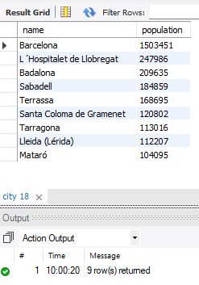
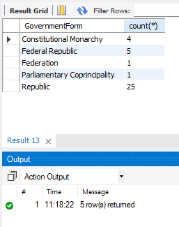
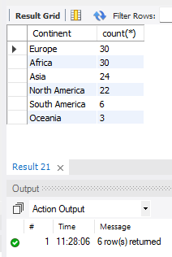
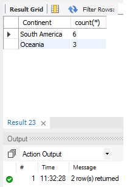
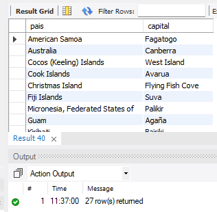
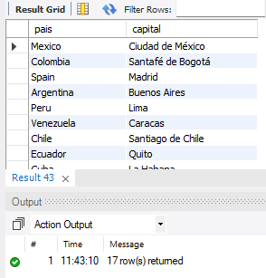

# Grupo de ejercicios 2

## Ejercicios básicos

1. Contar los paises con menos de 10.000 habitantes. Resultado: 19.
2. Contar los paises con más de 9999 habitantes y menos de 50001. Resultado: 15.
3. Contar los continentes con algún pais con una esperanza de vida menor del 50% (LifeExpectancy). Resultado: 3.
4. Contar los paises con esperanza de vida informada. Resultado: 222.
5. Contar los paises con esperenza de vida sin informar. Resultado: 17.
6. Mostrar los códigos de pais que tienen ciudades llamadas Cordoba, Sevilla o Cadiz. Resultado: ARG, ESP, PHL, MEX.
7. Contar las regiones/distritos (district) que tiene España (ESP). Resultado: 17.
8. Mostrar el nombre y los habitantes de las ciudades de las regiones cuyo nombre contenga 'Kata'. Resultado: 9

   

## Ejercicios con group by

9. Mostrar las formas de gobierno y el número de paises de Europa (Continent) donde la forma de gobierno contenga 'public' o su año de independecia sea menor de 1500. Resultado: 5

   

10. Mostrar el número de paises por continente donde ha habido un incremento positivo de producto interior bruto (GNP-GPNOld). Mostrar ordenado por el número de paises en orden descendente.

    

11. El mismo ejercicio anterior, pero solo mostrar los grupos que tengan menos de 10 paises.

    

## Ejercicios con join

12. Mostrar los paises de Oceania con el nombre de su capital.

    

13. Mostrar pais y capital de paises donde el español se hable más de un 70% (campos Language y Percentage), ordenado por la población del pais en orden descendente.

    
