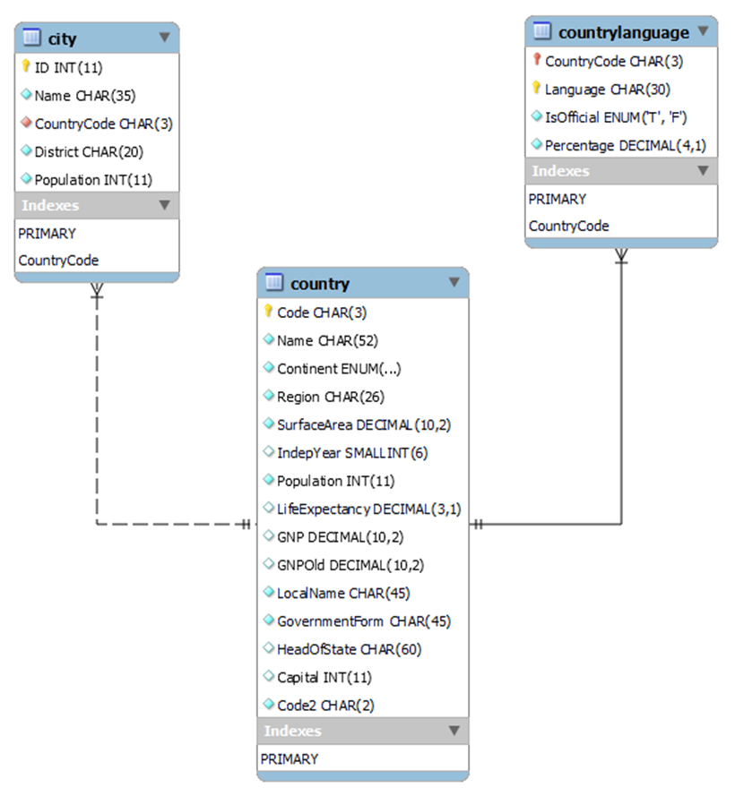
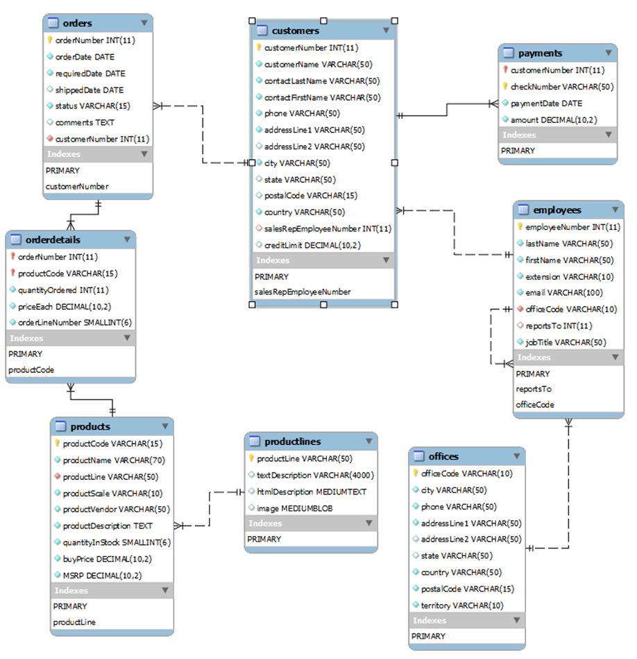

# Modelos de bases de datos para los ejercicios

## World

En esta base de datos encontramos una tabla de países (country) relacionada con una tabla de ciudades(city), así como una tabla de idiomas (countrylanguage) que se hablan en cada país.

[world.sql](./scripts/world.sql)

## ClassicModels

En este caso nos encontramos con un modelo clásico de base de datos de ventas, donde hay una tabla de clientes (customers) y una tabla de empleados (employees) asociada por el campo representante de ventas (salesRepEmployeeNumber). Los clientes tienen albaranes (orders) que a su vez están asociados al detalle del albaran (orderdetails). A cada detalle se asocia un producto (products), el cual a su vez pertenece a una línea de producto o categoría (productlines). En cuanto a los empleados, estos tienen relacionada una oficina (office) así como un jefe (reportsTo).

[classicmodels.sql](./scripts/classicmodels.sql)

## Proveedores

Modelo que representa las compras a proveedores de un catálogo de piezas

[Proveedores](./proveedores.md)
