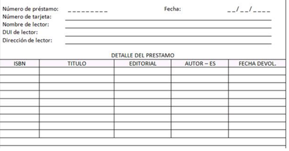

# Ejercicios de modelado de bases de datos

## Modelado de datos de una factura

Aplicar las reglas de normalización a los datos contenidos en el fichero excel del ejemplo: [facturas](./Normalizacion1.xlsx)

## Biblioteca

Modelar una base de datos para gestionar los préstamos de libros en una biblioteca. Para ello se deberá guardar la ficha de préstamo que rellena el lector con los siguientes datos:

