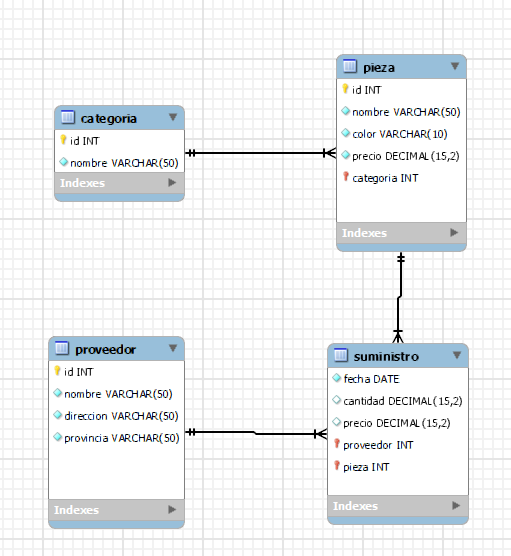

# Requisitos

[Enunciado ./Proveedores.pdf](./Proveedores.pdf)

- Proveedor: codigo, nombre, dirección, provincia.
- Varios proveedores pueden suministrar la misma pieza.
- Suministro: proveedor, fecha, pieza, cantidad.
- Pieza: código, nombre, color, precio y categoria.
- Categoría: código, nombre
- Una pieza solo puede pertenecer a una categoría

# Tablas

## Proveedor

| Campo     | Tipo        | NN  | PK/FK | Adicional |
| --------- | ----------- | --- | ----- | --------- |
| id        | uint        | x   | pk    | ai        |
| nombre    | varchar(50) | x   |       |           |
| direccion | varchar(50) | x   |       |           |
| provincia | varchar(50) | x   |       |           |

## Pieza

| Campo     | Tipo          | NN  | PK/FK | Adicional |
| --------- | ------------- | --- | ----- | --------- |
| id        | uint          | x   | pk    | ai        |
| nombre    | varchar(50)   | x   |       |           |
| color     | varchar(10)   | x   |       |           |
| precio    | decimal(15,2) | x   |       |           |
| categoria | uint          | x   | fk    |           |

## Categoría

| Campo  | Tipo        | NN  | PK/FK | Adicional |
| ------ | ----------- | --- | ----- | --------- |
| id     | uint        | x   | pk    | ai        |
| nombre | varchar(50) | x   |       |           |

## Suministro

| Campo     | Tipo          | NN  | PK/FK | Adicional |
| --------- | ------------- | --- | ----- | --------- |
| pieza     | uint          | x   | pk/fk |           |
| proveedor | uint          | x   | pk/fk |           |
| fecha     | date          | x   |       |           |
| cantidad  | decimal(15,2) | x   |       |           |
| precio    | decimal(15,2) | x   |       |           |

# Modelo

[./modelos/proveedores.mwb](./modelos/proveedores.mwb)

[./scripts/proveedores.sql](./scripts/proveedores.sql)

